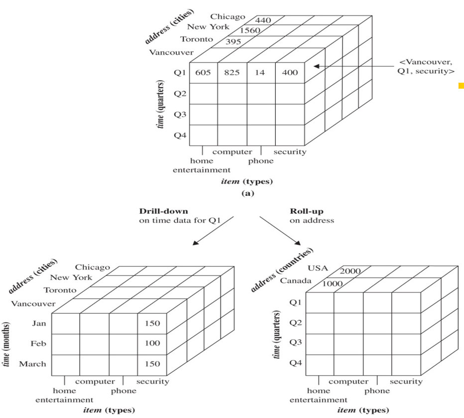
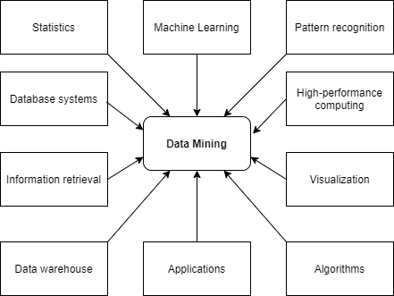

# Data mining

::: tip Definition

Extraction of interesting patterns or knowledge from huge amount of data. In addition,
we might find something we didn't want.Thus, data mining is knowledge discovery
in databases. However, semple *search* and *query processing* are **not** data mining.
*Logic based inferences on facts* are **not** data mining as well.

:::
*Descriptive & Predictive*

Characterize properties of the data in a data set, and perform inductions on the current data in order to make predictions in future data.

## Objects

---

### Data warehouse & database

Data Warehouse:

- A repository of information collected from multiple sources, stored under a unified schema, and usually residing at a single site.
- Data often organized around major subjects along the temporal aspect: customer, supplier, activity
- Data are often aggregated (not details of each transaction)  
- Data organized in a **data cube**
- Support multidimensional data mining(exploratory multidimensional data mining)

Database:

- an organized collection of information stored in a way that makes logical sense and that facilitates easier search, retrieval, manipulation, and analysis of data.

[**What are differences?**](https://www.xplenty.com/blog/data-warehouse-vs-database-what-are-the-key-differences/)

### Data Cube

A data cube always be mutldimension(3D or more) and commonly used for data warehousing.

This below is an example of a Data Cube.


## Prograss

---
<!-- add content mirror on it -->
1. Data cleaning
2. Data integration
3. Data selection
4. Data transformation
5. Data mining
6. Pattern evaluation
7. Knowledge presentation

## Data Mining Seen vs. Different Dimensions

### Data to be mined

Database data, data warehouse, transactional data, stream, spatiotemporal, time-series, sequence, text and web, multi-media, graphs & social and information networks.

### Knowledge to be mined

- Characterization, discrimination, association, classification, clustering, trend/deviation, outlier analysis.
- Description vs. Predictive data mining
- Multiple/integrated funtions and mining at multiple levels

### Patterns can be mined

- Association, correlation & causation (strong correlation doesn't automatically indicate a causal relationship)

- Frequuent patterns (Frequent itemset/sequential/structure patterns)

    ``` matlab
    # example:
    Age(X, “20..29”) Ʌ income (X, “40..49K”) => buys (X, “laptop”)
    [support = 2%, confidence = 60%]
    ```

- Classification and Regression for Predictive Analysis
  - use Decision trees, support vector machines, neural networks, logistic regression, etc.

- Cluster Analysis (indentify groups of customers based on their shopping habit)
  - unsupervised learning, to maximiz intra-group similarity & minimiz inter-group similarity (avoid using 'classes')

- Outlier Analysis (anomaly mining)
  - Outlier: A data object that doesn't comply with the general behavior of the data
  - Usefule in fraud detection, rare events analyses

### Evaluation of Patterns

- Interesting or not
  - Understandable by human
  - Valid on new data with some degree of certainty
  - Potentially useful
  - Novel
- Objective measures (accuracy, precision, recall etc.)
  - Support `(x=>y) = P(X U Y)`
  - Confidence `(x=>y) = P(Y|X)` where X and Y are itemsets
  - S-C Threshold are applied to select rules
- Subjective measures (Goal oriented, Actionable, Unexpectedness)

### What technology are used



## Major issues in Data Mining

- Mining Methodology
  - Mining various and new kinds of knowledge
  - Mining knowledge in multi-dimensional space
  - Data mining: An interdisciplinary effort
  - Boosting the power of discovery in a networked environment
  - Handling noise, uncertainty, and incompleteness of data
  - Pattern evaluation and pattern- or constraint-guided mining
- User Interaction
  - Interactive mining
  - Incorporation of background knowledge
  - Presentation and visualization of data mining results
- Efficiency and Scalability
  - Efficiency and scalability of data mining algorithms
  - Parallel, distributed, stream, and incremental mining methods
- Diversity of data types
  - Handling complex types of data
  - Mining dynamic, networked, and global data repositories
- Data mining and society
  - Social impacts of data mining
  - Privacy-preserving data mining
  - Invisible data mining

## Data Preprocessing

The reason we need to do the data preprocessing is we want the data quality(**accuracy, completeness, and timeliness**) could reach our exception. **Believability** and **interpretability** also affecting data quality.

### Data cleaning

**Data cleaning** routines work to 'clean' to data by filling in missing values, smoothing noisy data, identifying or removing outlier, and resolving inconsistencies. In this prograss you may also have data from multiple sources, and this would involve integrating multiple database, data cube, or files. (ie.,data integration)

Data reduction obtains a reduced representation of the data set that is much smaller in volume, yet produces the same/similar analytical results.

Data reduction has *dimensionality reduction* and *numerosity reduction*.

**Data transformation** has multiple forms of normalization, data discretization and concept hierarchy generation.

#### Missing Values

There are some way to handle missing values:

1. Ignore the tuple
2. Fill in the missing value manually
3. Use a global constant to fill in the missing vlaue
4. Use a measure of central tendency for the attribute to fill in the missing value
5. Use the attribute mean or median for all samples belonging to the same class as the given tuple
6. Use the most probable value to fill in the missing value

#### Noisy Data

Noise is a random error or variance in a measured variable. To remove noise in data, we have following data smoothing techniques:

1. Bining: Bining methods smooth a sorted data value by consulting its "neighborhood", that is, the values around it. Generally, we can use *smoothing by bin means*, *smoothing by bin medians*, *smoothing by bin boundaries*, *regression*, *outlier analysis*.

::: tip Note

- Smoothing by bin means: each value in the bin is replaced by mean
- Smoothing by bin median: each value in the bin is replaced by median
- Smoothing by bin boundaries: each value in the bin is replaced by the closest boundary value.
- Regression: Linear regression involves finding the "best" line to fit two attribute. Multiple linear regression is an extension of linear regression, where more than two attributes are involved and the data are fit to a multidimensional surface.
- Outlier analysis: Outliners may be detected by clustering where similar values are organized into groups. or "clusters".

:::

Many data smoothing methods are also used for data discretization and data reduction.

The data should also be examined regarding unique rules, consecutive rules, and null
rules. A **unique rule** says that each value of the given attribute must be different from
all other values for that attribute. A **consecutive rule** says that there can be no missing
values between the lowest and highest values for the attribute, and that all values
must also be unique (e.g., as in check numbers). A **null rule** specifies the use of blanks,
question marks, special characters, or other strings that may indicate the null condition
(e.g., where a value for a given attribute is not available), and how such values should
be handled.

### Data Integration

#### Redundancy and correclation analysis

Redundancy is another important issue in data integration. Some redundancies can be detected by **correlation analysis**. For nominal data we use *chi-square test*; For numeric attributes we can use the *correlation coeffient* and *covariance*.

### Data Reduction


### Data Transformation and Data Discretization

In data transformation, the data are transformed or consolidated into forms appropriate for mining. Straregies for data transformation include the following:

- Smoothing
- Attribute construciton
- Aggregation
- Normalization: the attribute data are too far so as to fall within a smaller range
- Discretization
- Concept hierarchy generation for nominal data

### Normalization

Normalization trying to give all attributes an equal weight.

#### Min-max normalization

We map the min and max of values to new min value and new max value. which is [min, max] -> [new_min, new_max]. Then we use the mapped value for the rest of steps. Thus, the range of min-max normalization is [new_min, new_max].

#### Z-score normalization

The values for an attribute, A, are normalized based on the **mean** and **standard deviation** of A. Each value equal to (value_i - mean)/(standard deviation). It's hard to say the range of it.

#### Decimal scaling normalization

Moving the decimal point of values of attribute to make sure that the maximum absolute value is smaller than 1. Generally, the range of decimal scaling normalization is (-1, 1)

## REFERENCE


<Valine></Valine>
