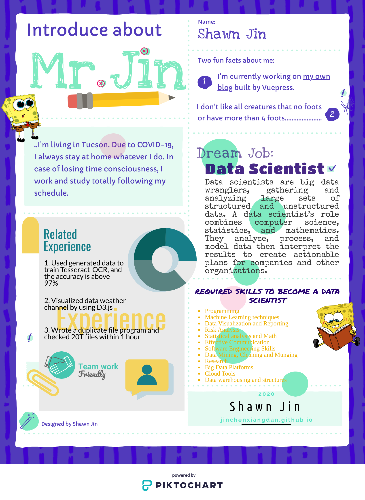

# About Data Visualization

## Data visualization vs. Information Visulization

- Data vs. Information
- Visualiza raw data vs. visualize processed data

## Infographic

Use data visualization or other visuals to tell a story, for a defined audience, with
level of subjectiveness, and heavy on graphic design.

There is an infographic example of "About Me":

## Why Data Visualization

1. Gain insight into an information spcae by mapping data onto graphical primitives.
2. Provide qualitative overview of large data sets.
3. Search for patterns, trends, structure, irregularities, relationships among data.
4. Help find interesting regions and suitable parameters for further quantitative analysis.
5. Provide a visual proof of computer representations derived

