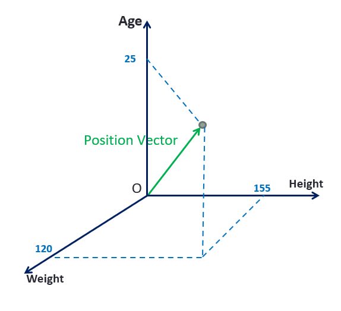

# Support Vector Machines


## Terminology and Concepts

Each point can be shown in a vector space. Supposed we have a data show below

```json
{
    // user name: Monica
    Height: 155, // in cm
    Weight: 120, // in lbs
    Age: 25
}
```

And the vector would be like below



### Vector Adding

$$
\begin{bmatrix}
1 \\ 2 \\ 3
\end{bmatrix}
+
\begin{bmatrix}
10 \\ 15 \\ 20
\end{bmatrix}
=
\begin{bmatrix}
11 \\ 17 \\ 23
\end{bmatrix}
$$

