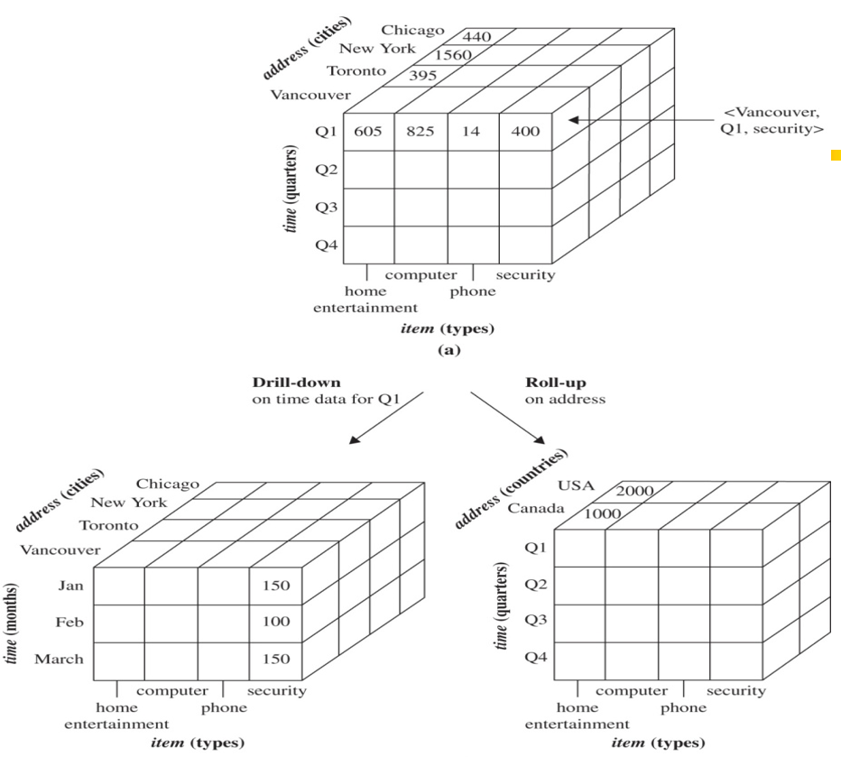

# Data mining

::: tip Definition

Extraction of interesting patterns or knowledge from huge amount of data. In addition,
we might find something we didn't want.Thus, data mining is knowledge discovery
in databases. However, semple *search* and *query processing* are **not** data mining.
*Logic based inferences on facts* are **not** data mining as well.

:::

## Objects

---

### Data warehouse & database

Data Warehouse:

- A repository of information collected from multiple sources, stored under a unified schema, and usually residing at a single site.
- Data often organized around major subjects along the temporal aspect: customer, supplier, activity
- Data are often aggregated (not details of each transaction)  
- Data organized in a **data cube**
- Support multidimensional data mining(exploratory multidimensional data mining)

Database:

### Data Cube

A data cube always be mutldimension(3D or more) and commonly used for data warehousing.

This below is an example of a Data Cube.

## Prograss

---
<!-- add content mirror on it -->
- Data cleaning
- Data integration
- Data selection
- Data transformation
- Data mining
- Pattern evaluation
- Knowledge presentation

## Data Mining Seen vs. Different Dimensions

### Data to be mined

Database data, data warehouse, transactional data, stream, spatiotemporal, time-series, sequence, text and web, multi-media, graphs & social and information networks.

### Knowledge to be mined

- Characterization, discrimination, association, classification, clustering, trend/deviation, outlier analysis.
- Description vs. Predictive data mining
- Multiple/integrated funtions and mining at multiple levels

to be continued
